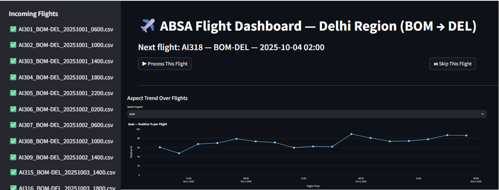
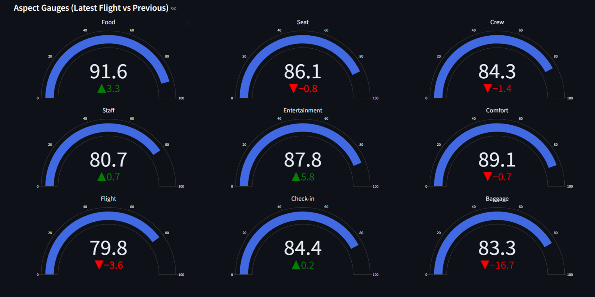

# BERT Airline Sentiment Analysis Dashboard

Aspect-Based Sentiment Analysis (ABSA) for airline reviews using a fine-tuned BERT model, presented through a Streamlit dashboard.

## Overview

This project analyzes airline reviews to extract sentiment for different aspects like food, seat comfort, crew service, baggage handling, and more. It processes incoming flight data and provides real-time sentiment tracking via a Streamlit dashboard.

## Features

- **BERT-based Sentiment Analysis** — Fine-tuned binary classifier (positive/negative)
- **Aspect extraction** — Rule-based aspect pickers per sentence (food, seat, crew, staff, entertainment, comfort, flight, check-in, baggage)
- **Live dashboard** — Process/skip flights, auto-rerun after ingestion, and view trend lines + gauges
- **Flight pipeline** — Reads flight CSVs from `ABSA_UI/incoming_flights/` with naming `FLIGHT_ROUTE_YYYYMMDD_HHMM.csv`
- **History + deltas** — Stores per-aspect history, shows latest vs previous flight deltas

## How it works

1) Drop flight CSVs into `ABSA_UI/incoming_flights/` (one row per review; expected column `Cleaned_Reviews` or `review`/`Review`/`cleaned_review`).
2) Click **Process This Flight** in the dashboard. Each review is split into sentences, aspects are matched, sentiments predicted via BERT, and appended to `airline_reviews_with_aspect_sentiments.csv`.
3) Per-flight aspect positive rates are computed and stored in `state.json` to drive gauges and trend charts.

## Quick start (local)

```bash
git clone https://github.com/Tahir-2802/Sentimental-Analysis-of-Airline-Reviews.git
cd Sentimental-Analysis-of-Airline-Reviews
pip install -r requirements.txt
python -c "import nltk; nltk.download('punkt')"
python -m streamlit run FINAL_PRODUCT.py
```

### Add a sample flight

```powershell
Copy-Item "ABSA_UI\samples\AI301_sample.csv" "ABSA_UI\incoming_flights\AI301_BOM-DEL_20251001_0600.csv" -Force
```
Then refresh the app and press **Process This Flight**.

### Reset state (if needed)

Delete `ABSA_UI/state.json` to reset processed/next-file tracking and charts.

## Screenshots




## Project Structure

```
bert_airline_sentiment_model/
├── FINAL_PRODUCT.py                          # Main Streamlit application
├── ABSA_UI/
│   ├── Model/                                # BERT model files (tokenizer, config, weights)
│   ├── incoming_flights/                     # Flight CSV files for processing
│   ├── airline_reviews_with_aspect_sentiments.csv  # Output data
│   └── state.json                            # Application state tracking
├── requirements.txt                          # Python dependencies
└── README.md                                 # This file
```

## Installation

### Prerequisites
- Python 3.8 or higher
- pip package manager

### Setup

1. Clone the repository:
```bash
git clone https://github.com/Tahir-2802/Sentimental-Analysis-of-Airline-Reviews.git
cd Sentimental-Analysis-of-Airline-Reviews
```

2. Install dependencies:
```bash
pip install -r requirements.txt
```

3. Download NLTK data:
```bash
python -c "import nltk; nltk.download('punkt')"
```

4. **Add BERT Model Files**:
  - Place model artifacts in `ABSA_UI/Model/`:
    - `config.json`
    - `vocab.txt`
    - `model.safetensors` (or `pytorch_model.bin`)
    - `training_args.bin`
  - These are tracked with Git LFS; if you don’t have them locally, download/provide your own fine-tuned weights.

5. Optional: Use sample data
   - A tiny sample is provided in `ABSA_UI/samples/AI301_sample.csv`
   - Copy it into `ABSA_UI/incoming_flights/` to simulate a flight (see quick start snippet above)

## Usage

Run the Streamlit dashboard:

```bash
python -m streamlit run FINAL_PRODUCT.py
```

The app will start on `http://localhost:8501`.

### Dashboard Features
- **Flight queue** — Lists incoming flight CSVs; mark processed/next/queued
- **Process / Skip** — Process a flight or skip to the next without ingestion
- **Trend chart** — Aspect positive% over flight time
- **Gauges** — Latest vs previous flight delta per aspect

## Configuration

Edit `FINAL_PRODUCT.py` to modify:
- `ASPECTS` - Sentiment aspects to track
- `INCOMING_DIR` - Directory with flight CSV files
- `HISTORY_CAP` - Maximum history entries per aspect
- `MAX_SEQ_LEN` - BERT tokenizer max sequence length

## Model Details

- **Model**: BERT sequence classifier (binary positive/negative)
- **Tokenizer/Weights**: `ABSA_UI/Model/` (tracked via Git LFS)
- **Max length**: `MAX_SEQ_LEN` (default 128)
- **Device**: Auto-selects CUDA if available, else CPU

## Data Format

### Input (incoming_flights/*.csv)
```
Cleaned_Reviews
"Great flight experience with excellent crew service"
"Food quality was poor but seat was comfortable"
```

### Output (airline_reviews_with_aspect_sentiments.csv)
```
Review_Text,Aspect_Sentiments,Flight_No,Route,Date,Time
"Great service","{\"crew\": \"Positive\", \"service\": \"Positive\"}",AI301,BOM-DEL,2025-10-01,06:00
```

## Dependencies

- **pandas** - Data manipulation
- **transformers** - BERT model and tokenizer
- **torch** - PyTorch deep learning framework
- **nltk** - Natural language processing (sentence tokenization)
- **plotly** - Interactive visualizations
- **streamlit** - Web dashboard framework
- **scikit-learn** - Machine learning utilities

## License

MIT License

## Author

Created for airline sentiment analysis project

## Support

For issues or questions, please open an issue on GitHub.
